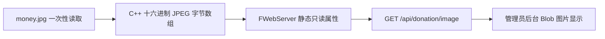

# 赞赏码最终最小实现蓝图

## 1. 技术结论

可以直接把原始 JPEG 字节写入 C++ 代码，并且比 Base64 更合适。

当前 [`money.jpg`](../money.jpg) 的数据规模：

- 原始 JPEG：93,951 字节；
- Base64：125,268 个字符；
- Base64 比原始字节约增加 33.3%；
- SHA-256：`3BECA2F0C31AA5614ABFDC1A9A34E77D7308433DE251316552C98BF6E2633EAA`。

因此最终采用原始 JPEG 字节数组，不采用 Base64。这样没有 Base64 体积膨胀，也不需要程序启动时解码，不会额外保存一份解码结果。

## 2. 已确认边界

- 源图片当前位于项目根目录 [`money.jpg`](../money.jpg)。
- 现在一次性将 JPEG 原始字节转换成 C++ 十六进制数组并写入程序源码。
- 不在构建过程中读取或转换图片。
- 图片字节数据直接归属 [`FWebServer`](../yuanbook/WebServer.h:135)。
- 由 [`FWebServer`](../yuanbook/WebServer.h:135) 实现赞赏图片接口。
- 不创建赞赏资源管理器、不创建通用资源库、不增加数据库配置。
- 图片接口允许所有已登录用户读取，页面入口只放在管理员后台。

## 3. WebServer 图片属性

在 [`FWebServer`](../yuanbook/WebServer.h:135) 中保存以下只读属性：

- JPEG 字节数组；
- JPEG 字节长度。

推荐将约 93 KB 的字节数组定义为 [`FWebServer`](../yuanbook/WebServer.h:135) 的静态只读属性，而不是每个实例都持有一份动态副本。这样：

- 可执行程序中只保存一份 JPEG 数据；
- 创建 [`FWebServer`](../yuanbook/WebServer.h:135) 实例时不复制图片；
- 不产生 Base64 解码内存；
- HTTP 请求直接读取该数组。

为了避免把 93 KB 数组塞入头文件并拖慢所有包含单元，属性在 [`yuanbook/WebServer.h`](../yuanbook/WebServer.h) 中声明，在 [`yuanbook/WebServer.cpp`](../yuanbook/WebServer.cpp) 中定义。图片数据仍然是 WebServer 的属性，不引入额外资源类或管理器。

数组形式为十六进制字节，例如 `0xFF, 0xD8, ... , 0xFF, 0xD9`。这些字节就是原始 JPEG 文件内容，不是重新压缩后的图片。

## 4. 图片 API

在 [`FWebServer`](../yuanbook/WebServer.h:135) 增加 [`FWebServer::HandleDonationImage()`](../yuanbook/WebServer.cpp) 私有函数，并由 [`FWebServer::SetupRoutes()`](../yuanbook/WebServer.cpp:1561) 注册：

- 请求：GET /api/donation/image
- 登录要求：有效登录会话；普通用户和管理员均可访问。
- 认证：复用 [`FWebServer::CheckAuth()`](../yuanbook/WebServer.cpp:583)。
- 成功响应：200、`image/jpeg`、响应体直接来自内置 JPEG 字节数组。
- 未登录：401。
- 响应头：`Cache-Control: private, max-age=3600`、`X-Content-Type-Options: nosniff`。

HTTP 层直接返回 JPEG 二进制，不使用 JSON，不使用 Base64，前端无需执行图片解码。

## 5. 管理员前端

修改 [`www/admin.html`](../www/admin.html)：

- 新增“赞赏捐赠”页签；
- 增加简单图片区域、固定说明和错误提示；
- 不引用磁盘图片路径。

修改 [`www/js/admin.js`](../www/js/admin.js)：

1. 扩展现有后台页签切换；
2. 首次进入赞赏页时请求 GET /api/donation/image；
3. 使用 Authorization Bearer 请求头携带现有 Token；
4. 将响应转换为 Blob 对象 URL；
5. 设置到图片元素；
6. 失败时显示错误；
7. 重复切换复用已经创建的对象 URL。

修改 [`www/css/style.css`](../www/css/style.css)，只增加必要的居中、最大宽度和移动端样式。

## 6. 数据流

## 7. 空间对比

| 方案 | 程序内主要数据 | 运行时额外数据 | 结论 |
|---|---:|---:|---|
| 原始 JPEG 字节数组 | 约 93,951 字节 | 无 | 推荐 |
| Base64 字符串 | 约 125,268 字节 | 解码后还需约 93,951 字节，除非每次请求临时解码 | 不推荐 |
| 启动时读取磁盘 JPEG | 可执行程序不含图片 | 约 93,951 字节 | 不满足防误删目标 |

说明：十六进制数组的 C++ 源文件文本会明显大于 93 KB，但编译后的二进制数据段保存的是原始字节，主要占用仍接近 JPEG 本身大小。源码体积增大不等于可执行程序按文本字符数膨胀。

## 8. 根目录图片处理

完成字节数组写入并验证一致性后，[`money.jpg`](../money.jpg) 不再是编译或运行依赖。

可以保留原图作为人工维护源，也可以从仓库删除。无论原图是否存在，后续普通编译都只使用已经写入 [`yuanbook/WebServer.cpp`](../yuanbook/WebServer.cpp) 的字节数组。

## 9. 最小测试范围

1. 内置数组长度等于 93,951 字节。
2. 内置数组以 JPEG 文件头 `FF D8` 开始，以 `FF D9` 结束。
3. 内置数组 SHA-256 与原图一致。
4. 删除或移动根目录 [`money.jpg`](../money.jpg) 后，项目仍可编译运行。
5. 未登录调用接口返回 401。
6. 普通已登录用户调用接口返回 200 和 `image/jpeg`。
7. 管理员后台页签能够显示赞赏码。
8. 发布包无需包含独立图片文件。

## 10. 修改清单

- 修改 [`yuanbook/WebServer.h`](../yuanbook/WebServer.h)
- 修改 [`yuanbook/WebServer.cpp`](../yuanbook/WebServer.cpp)
- 修改 [`www/admin.html`](../www/admin.html)
- 修改 [`www/js/admin.js`](../www/js/admin.js)
- 修改 [`www/css/style.css`](../www/css/style.css)
- 增加最小接口与内置图片完整性测试

无需增加图片管理器、资源抽象、构建生成脚本或数据库字段。
